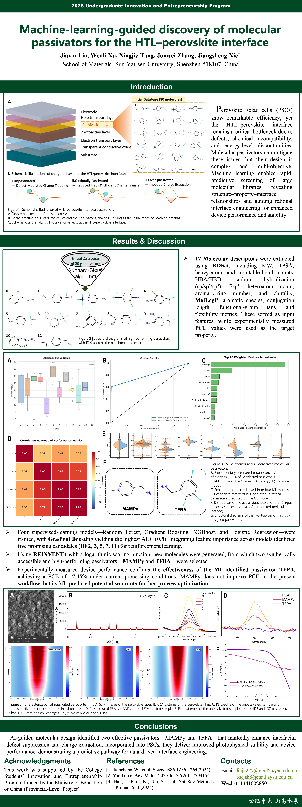

# Perovskite Solar Cell Passivation Agent Screening via Machine Learning

> **Machine Learning-Driven Optimization of Perovskite Solar Cell Interface Passivation Agents**
> 
> Sun Yat-sen University · School of Materials Science and Engineering · Innovation Training Project (No. 20250057)

---

## 📌 Conference Poster

> Presented at the 2025 Undergraduate Innovation and Entrepreneurship Program



---

## 📖 Project Overview

Perovskite solar cells (PSCs) have emerged as a leading next-generation photovoltaic technology, but interface defects at the hole transport layer (HTL)/perovskite junction remain a critical bottleneck limiting both efficiency and stability.

This project develops a **data-driven, closed-loop molecular design framework** for HTL/perovskite interface passivation agents, integrating:

1. **Structured passivation agent database** — 12 experimentally characterized organic small molecules with 17 molecular descriptors and device performance metrics
2. **Machine learning screening** — Gradient Boosting, Random Forest, XGBoost, and Logistic Regression for structure–performance prediction
3. **Reinforcement learning molecular generation** — REINVENT4-based directed generation of novel passivation candidates
4. **Experimental validation** — Synthesis and characterization of AI-designed molecules (MAMPy and TFPA)

**Best result:** TFPA-passivated device achieved **PCE = 17.45%** (Jsc = 24.38 mA·cm⁻², Voc = 0.961 V, FF = 74.48%).

---

## 🗂️ Repository Structure

```
perovskite-passivation-ml/
│
├── README.md                        # This file
├── requirements.txt                 # Python dependencies
│
├── data/
│   ├── ML_dataset.xlsx              # Core dataset: 12 molecules × 17 features + performance
│   ├── mol2mol.smi                  # Seed SMILES for REINVENT4 (5 top-performing molecules)
│   └── DATA_DESCRIPTION.md          # Detailed column-by-column data documentation
│
├── ml/
│   └── ml_screening.py              # ML training, cross-validation, ROC curves, feature importance
│
└── rl/
    └── rl_generation_config.toml    # REINVENT4 staged learning configuration
```

---

## 🚀 Quick Start

### 1. Clone the Repository

```bash
git clone https://github.com/<your-username>/perovskite-passivation-ml.git
cd perovskite-passivation-ml
```

### 2. Install Python Dependencies

```bash
pip install -r requirements.txt
```

### 3. Run ML Screening

```bash
cd ml
python ml_screening.py
```

This will output:
- 5-fold cross-validation AUC results for all four models
- ROC curve plots (`ROC_curves_cv_2x2.png`)
- Feature importance rankings (console + figures)

### 4. Run Reinforcement Learning (Requires REINVENT4)

> ⚠️ REINVENT4 must be installed separately. See [REINVENT4 GitHub](https://github.com/MolecularAI/REINVENT4) for installation instructions.

```bash
# Place mol2mol.smi in your REINVENT4 configs directory
# Then run:
reinvent rl/rl_generation_config.toml
```

---

## 📊 Key Results

### ML Model Performance (5-Fold Cross-Validation AUC)

| Model | AUC | Std Dev |
|-------|-----|---------|
| **Gradient Boosting** | **0.80** | **±0.24** |
| Random Forest | 0.70 | ±0.40 |
| XGBoost | 0.70 | ±0.24 |
| Logistic Regression | 0.40 | ±0.37 |

> Gradient Boosting performed best. Logistic Regression below random chance (AUC < 0.5), confirming a non-linear structure–performance relationship.

### Top Feature Importances (Weighted Ensemble)

| Rank | Feature | Importance |
|------|---------|------------|
| 1 | MolLogP (hydrophobicity) | 0.670 |
| 2 | MW (molecular weight) | 0.191 |
| 3 | TPSA (polar surface area) | 0.075 |
| 4 | NumHeavy (heavy atom count) | 0.067 |
| 5 | HBD (H-bond donors) | 0.051 |

### AI-Generated Molecules

| Molecule | Full Name | RL Score | Experimental PCE |
|----------|-----------|----------|-----------------|
| **TFPA** | (2,4,6-trifluorophenyl)methanamine | 0.93 | **17.45%** |
| MAMPy | 1-methyl-2-(aminomethyl)pyridin-1-ium | 0.95 | 1.32%* |

*MAMPy's low PCE is attributed to process-level side reactions with the Spiro-OMeTAD HTL dopant system at the tested concentration, not a fundamental molecular design flaw.

---

## 🔬 Workflow

```
[Dataset: 80 candidates] 
        ↓ Kennard-Stone sampling
[12 experimentally characterized molecules]
        ↓ 17 molecular descriptors
[ML Training: GB / RF / XGB / LR]
        ↓ Feature importance → scoring function
[REINVENT4: Generate 2027 candidates]
        ↓ Top 2 selected (MAMPy, TFPA)
[Experimental synthesis & characterization]
        ↓ PL / XRD / SEM / J-V
[Validation: TFPA → PCE 17.45%]
```

---

## 📁 Data Description

See [`data/DATA_DESCRIPTION.md`](data/DATA_DESCRIPTION.md) for full column definitions, units, and notes on each feature in `ML_dataset.xlsx`.

---

## 🛠️ Dependencies

### Python (ML Screening)
See `requirements.txt`. Key packages:
- `scikit-learn` — ML models and cross-validation
- `xgboost` — XGBoost classifier
- `rdkit` — Molecular descriptor calculation
- `pandas`, `numpy`, `matplotlib` — Data processing and visualization
- `openpyxl` — Excel file reading

### Reinforcement Learning
- [REINVENT4](https://github.com/MolecularAI/REINVENT4) — Must be installed separately
- Prior model: `mol2mol_high_similarity.prior` (available from REINVENT4 releases)

---

## 👥 Team

| Name | Role |
|------|------|
| Lin Jiaxin (林嘉馨) | ML model training, data analysis |
| Xu Wenli (徐文丽) | Reinforcement learning model |
| Tang Ningjie (唐凝捷) | Experimental work |
| Zhang Junwei (张俊炜) | Experimental work |

**Supervisor:** Prof. Xie Jiangsheng (谢江生), Associate Professor, School of Materials Science, Sun Yat-sen University

---

## 📄 Citation

If you use this dataset or code in your research, please cite:

```
Lin, J., Xu, W., Tang, N., Zhang, J. (2025). Machine Learning-Driven Optimization of 
Perovskite Solar Cell Interface Passivation Agents. Sun Yat-sen University Innovation 
Training Project No. 20250057.
```

---

## 📜 License

This project is released under the MIT License. The experimental dataset (`ML_dataset.xlsx`) is original data collected by the project team and is included under the same license.

---

## 🙏 Acknowledgements

This work was supported by Sun Yat-sen University Innovation Training Program (Provincial Level, No. 20250057). We thank the School of Materials Science for providing laboratory facilities and the REINVENT4 team (Molecular AI, AstraZeneca) for the open-source molecular generation framework.
